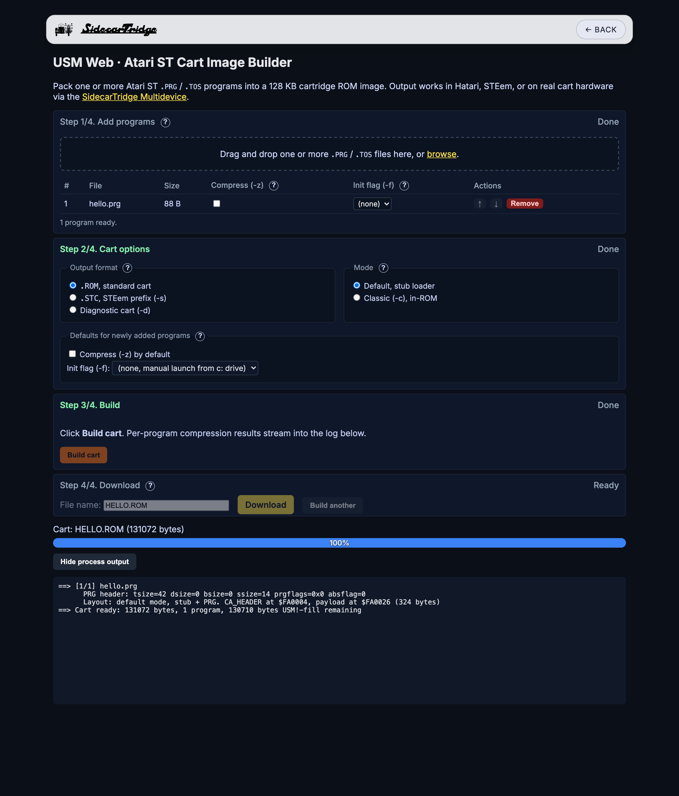

# USM-web

> **Pack Atari ST programs into 128 KB cartridge ROM images, in your browser.**

[](https://github.com/sidecartridge/USM-web/actions/workflows/test.yml)
[](LICENSE)
[](https://usm.sidecartridge.com)

USM-web is a single-file browser port of [**USM**](https://github.com/sidecartridge/USM), the original cartridge-image builder created by [**@ggnkua**](https://github.com/ggnkua). The idea, the cart format, the 68k stub-loader work, and the LZSS-12-4 bitstream are all his; this repository takes that command-line C tool and reimplements it in JavaScript so anyone with a modern browser can build a working `.ROM` without touching a compiler. Output is held to **byte-for-byte parity** with the upstream C reference for every supported flag combination.



## Try it live

Open <https://usm.sidecartridge.com/>, drag a `.PRG` or `.TOS` file onto the page, click **Build cart**, and download the resulting `.ROM`. Nothing leaves your machine, the cart is assembled entirely in the browser.

For offline use, clone the repository and open `index.html` directly. The file is fully self-contained.

## Features

- **Default mode**, embeds a 236-byte 68k stub loader plus the verbatim PRG. Works for any well-formed program.
- **LZSS-12-4 compression (`-z`)**, byte-faithful port of the upstream encoder, with auto-fallback to the uncompressed entry when compression doesn't actually shrink the cart.
- **Classic mode (`-c`)**, relocates TEXT+DATA at build time so the program runs in place from ROM. BSS lands at a configurable RAM base (`-b`).
- **Diagnostic carts (`-d`)**, boot-time programs that execute on reset, before GEMDOS exists.
- **Multi-program carts**, any number of programs in one cart via the `CA_NEXT` chain. Per-program flag overrides supported (mix compressed and uncompressed entries freely).
- **STEem prefix (`-s`)**, prepends a 4-byte zero header so the output loads in STEem Engine.
- **Auto-launch (`-fY`)**, set TOS init-flags per program (run prior to display init, before boot disk, as a Desk Accessory, etc.).
- **Contextual help**, every key concept on the page has a `?` icon that opens a focused explanation.
- **Verbose build log**, per-program PRG header dump, cart-layout addresses, compression results, fixup counts, and a final cart summary.

## Quick start

1. **Open the app.** <https://usm.sidecartridge.com/> in any recent Chrome / Firefox / Safari.
2. **Add programs.** Drag-drop one or more `.PRG` / `.TOS` files onto Step 1, or click *browse*.
3. **Set options.** Step 2 picks the output format (`.ROM`, `.STC` for STEem, or Diagnostic), the mode (Default or Classic), and per-program flags. Click the `?` icons for help on any of them.
4. **Build.** Step 3, click **Build cart**. The log streams per-program structural detail and compression results.
5. **Download.** Step 4, pick a filename and click **Download**.

## Modes at a glance

| Mode                       | Option              | What ends up in ROM                                  | When to use                                              |
| -------------------------- | ------------------- | ---------------------------------------------------- | -------------------------------------------------------- |
| Default                    | *(default)*         | 236-byte stub loader + the verbatim PRG file         | The normal case, works for any well-formed PRG          |
| Default + LZSS compressed  | Compress checkbox   | 304-byte LZSS stub + the LZSS-compressed PRG         | Larger or repetitive PRGs you want to squeeze in         |
| Classic                    | Classic mode toggle | TEXT + DATA only, relocated to ROM addresses         | Tiny position-independent programs / early-boot code     |

Multi-program carts work in any mode and can mix compressed and uncompressed entries.

## Running the cart

- **Hatari**: `hatari --cartridge GAME.ROM`. Inside Hatari you'll see a `c:` drive on the desktop; double-click the PRG to run.
- **STEem Engine**: choose the `.STC` output format and load via STEem's cartridge insertion dialog (the prefix is what STEem expects).
- **Real hardware**: the safest path is the [**SidecarTridge Multidevice**](https://sidecartridge.com/products/sidecartridge-multidevice-atari-st/) in ROM-Emulation mode, drop the `.ROM` onto its storage and the device presents it to the ST as if it were a real cart, with no soldering, no UV erase cycles, no risk of bricking a chip.

## Limitations

Same as upstream USM:

- **Single-file programs only.** Programs that load companion files at runtime will fail, the cart has no filesystem.
- **128 KB maximum per program.** The cart itself is 128 KB, so anything larger physically can't fit.
- **Classic mode is fragile.** Programs that access BSS via PC-relative addressing won't work; the relocation table can't signal those references. Use Default mode for full applications.
- **Compression isn't always a win.** Already-packed programs and tiny inputs often grow under LZSS. USM-web auto-falls-back to the uncompressed entry per program when that happens; you'll see the decision in the log.

## Development

Source of truth is `src/`; the deployed `index.html` is a generated artifact (committed; CI verifies it stays in sync with `src/`).

```sh
npm ci                  # one-time install (Vitest only)
npm run build           # src/ -> index.html
npm test                # Vitest in node
npm run verify-goldens  # diff cart-writer output vs tests/golden/*.ROM
```

See [`AGENTS.md`](AGENTS.md) for the full project layout, code-style notes, and workflow rules. [`CLAUDE.md`](CLAUDE.md) covers the architecture in depth, module concatenation, byte-parity bar, the determinism trap, and the things-that-bite list. [`tests/README.md`](tests/README.md) explains the testing strategy and the goldens pipeline; [`tests/PIN-BUMP.md`](tests/PIN-BUMP.md) is the runbook for updating the upstream pin.

## Credits

- [**@ggnkua**](https://github.com/ggnkua), original USM concept, cart format design, 68k stub loaders, LZSS-12-4 bitstream design, and the C reference implementation this project ports.
- **tIn / Newline**, original stub-loader source code that USM's default mode is built on.
- [**Diego Parrilla**](https://github.com/diegoparrilla). GitHub Actions build matrix and various fixes contributed upstream; the USM-web JavaScript port and this site.

If you're using USM-web, consider giving the [upstream repository](https://github.com/sidecartridge/USM) a star, that's where the real work happened.

## License

GPL v3. See [`LICENSE`](LICENSE).
